# STM32F103RB_NUCLEO_BSP

STM32F103RB Nucleo 보드용 BSP (Board Support Package)

## Overview

추후 개인 프로젝트를 위해 STM32F103RB Nucleo 보드의 하드웨어를 추상화한 BSP 라이브러리입니다.
HAL을 직접 사용하지 않고 BSP 함수를 통해 하드웨어를 제어합니다.

## Support Board

- STM32F103RB-NUCLEO

## Dev Environment

- IDE: VSCode + STM32CubeIDE for VSCode
- MCU: STM32F103RB
- FW: STM32CubeF1 v1.8.7
- BUILD: CMake + Ninja

## Block Diagram

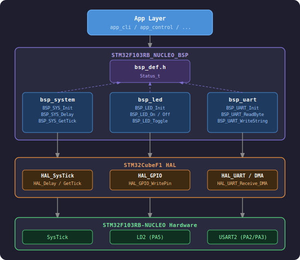

## Build
- Git Clone
```bash
mkdir ./Bsp
cd ./Bsp
git clone --recurse-submodules https://github.com/gitgunny/stm32f103rb_nucleo_bsp.git
```

- CMakeLists.txt에 아래 경로 추가
```cmake
target_sources(${CMAKE_PROJECT_NAME} PRIVATE
    ...
    ${CMAKE_CURRENT_SOURCE_DIR}/Bsp/stm32f103rb_nucleo_bsp/Src/bsp_hal.c
    ${CMAKE_CURRENT_SOURCE_DIR}/Bsp/stm32f103rb_nucleo_bsp/Src/bsp_led.c
    ${CMAKE_CURRENT_SOURCE_DIR}/Bsp/stm32f103rb_nucleo_bsp/Src/bsp_uart.c
    ...
)

target_include_directories(${CMAKE_PROJECT_NAME} PRIVATE
    ...
    ${CMAKE_CURRENT_SOURCE_DIR}/Bsp/stm32f103rb_nucleo_bsp/Inc
    ...
)
```

## CubeMX Setting

- Clock Configuration
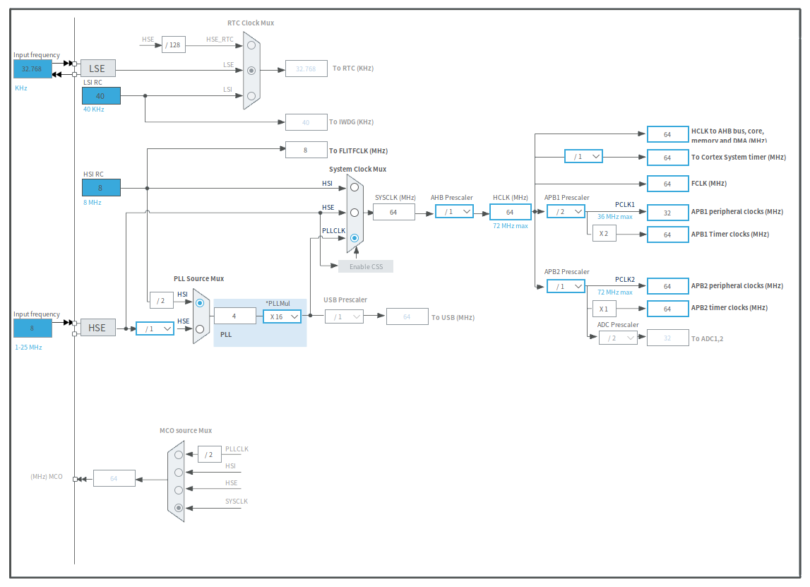

- Pinout & Configuration
  - Pinout View
    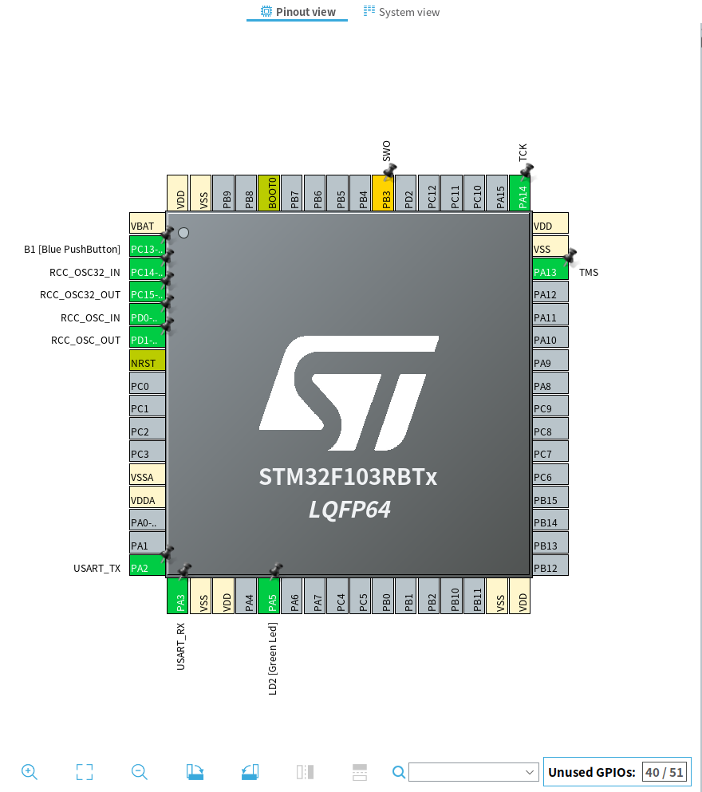
  - Configuration
    - System Core
      - GPIO
        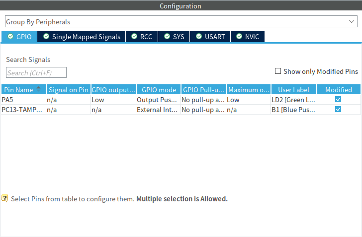
      - DMA
        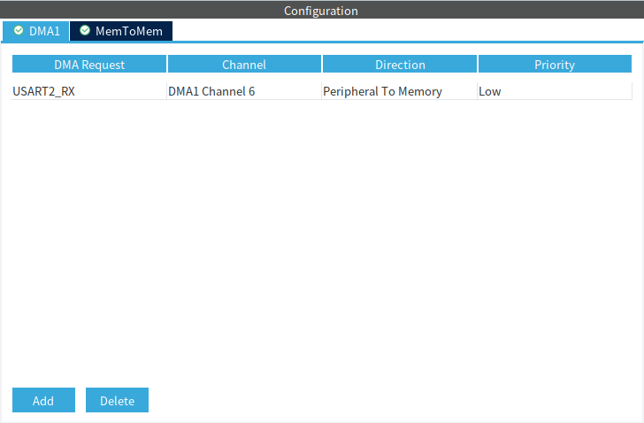
      - NVIC
        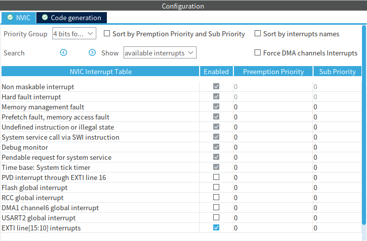
      - RCC
        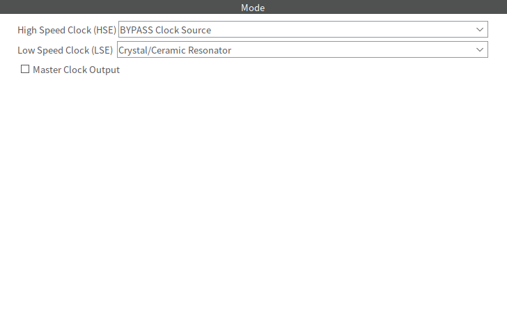
      - SYS
        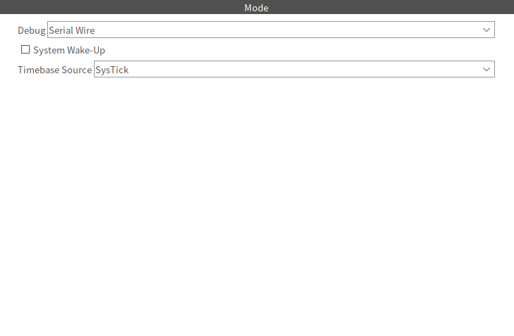
    - Connectivity
      - UASART2
        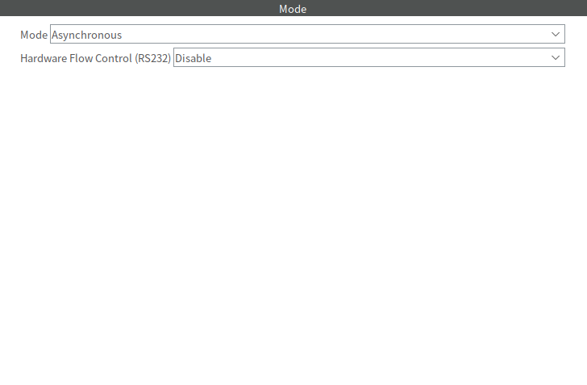
        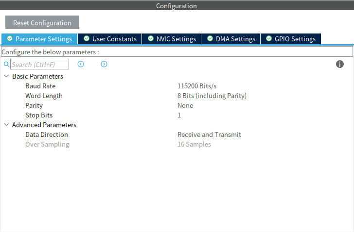
        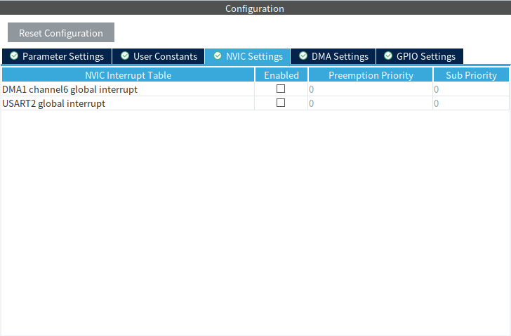
        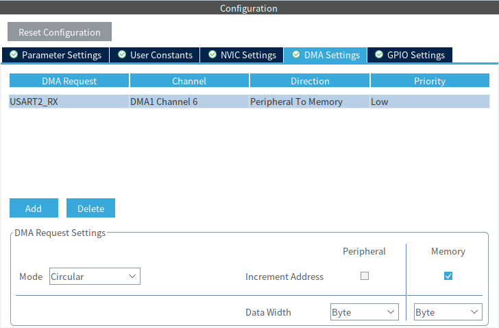

## Support Function

- bsp_def.h (Common)
  - `typedef enum BSP_Status_t`

- bsp_system.h
  - `void BSP_SYS_Init(void)`
  - `void BSP_SYS_Delay(uint32_t ms)`
  - `uint32_t BSP_SYS_GetTick(void)`

- bsp_led.h
  - `BSP_Status_t BSP_LED_Init(void)`
  - `BSP_Status_t BSP_LED_On(void)`
  - `BSP_Status_t BSP_LED_Off(void)`
  - `BSP_Status_t BSP_LED_Toggle(void)`

- bsp_uart.h
  - `BSP_Status_t BSP_UART_Init(void)`
  - `BSP_Status_t BSP_UART_ReadByte(const uint8_t *pByte)`
  - `BSP_Status_t BSP_UART_WriteByte(uint8_t *pByte)`
  - `BSP_Status_t BSP_UART_WriteString(uint8_t *pStr)`

## Example

### Before
```c
// led_control.c

#include "stm32f1xx_hal_gpio.h"

void Led_On(void) {
    HAL_GPIO_WritePin(GPIOA, GPIO_PIN_5, GPIO_PIN_RESET);
}

void Led_Off(void) {
...
```

### After
```c
// led_control.c

#include "bsp_led.h"

void Led_On(void) {
    BSP_LED_On();
}

void Led_Off(void) {
...
```

## Used By

- [APP_CLI](https://github.com/gitgunny/app_cli)
  - bsp_uart
  - bsp_led

## License

MIT License - [LICENSE](LICENSE)
